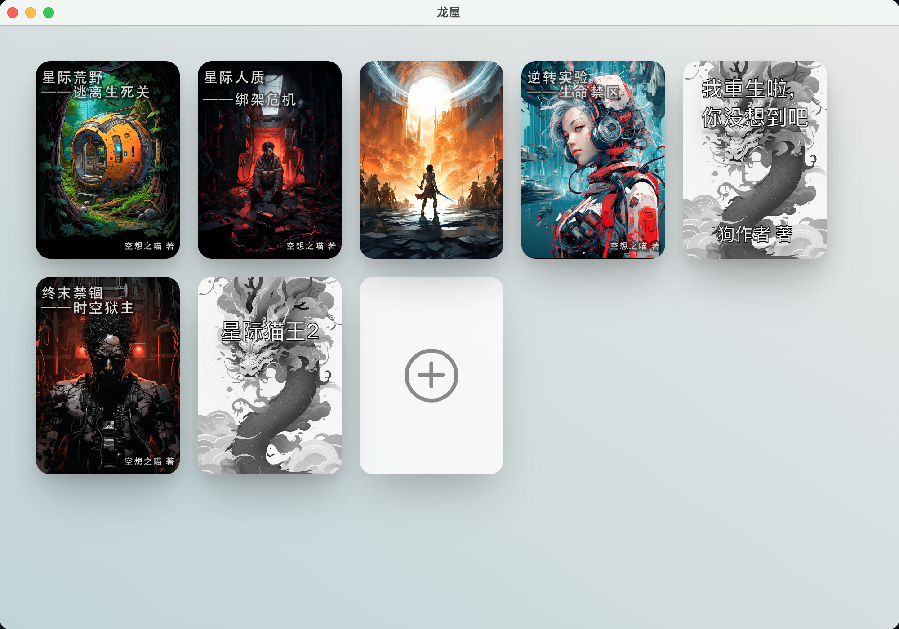
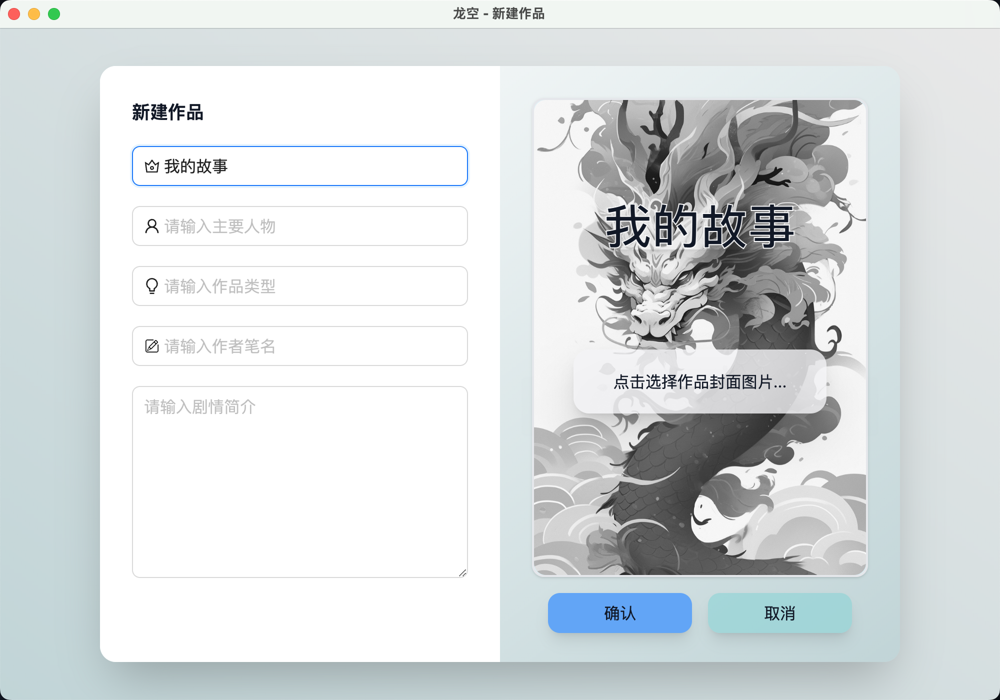
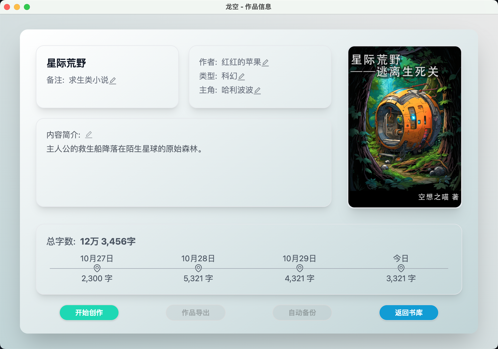

# 龙屋

一款专为网络写手开发的写作工具软件。

## 功能

纯享版功能：

- 专为网文写手定制UI，书籍管理，封面管理，简介管理，人物卡片，剧情大纲等；

- 背景颜色、透明度、图片自由更换；

- 字体、字体颜色、字体大小自由更换；

- 支持全屏沉浸写作模式；

- 所有数据保存在本地；

- 自动保存、自动备份；

- 快捷键插入新章节、设置标题级别；

- 自动识别章节目录，自动按标题级别显示字数；

- 支持卡片列表，可自由分类添加人物、道具、事件、副本卡片；

---

## 界面

## 纯享版设计

### 后端 API

#### 主题相关
- 加载主题； ✅
- 保存主题； ✅

#### 书籍相关
- 获取书籍列表； ✅
- 新建书籍；    ✅
- 更新书籍；    ✅
- 删除书籍；    ✅
- 导出书籍；    ✅
- 备份书籍；
- 导入书籍；    ✅
- 获取大纲；    ✅
- 保存大纲；    ✅

#### 卷相关
- 获取卷列表；  ✅
- 新建卷；     ✅
- 删除卷；     ✅
- 重命名卷；   ✅

#### 章相关
- 获取章列表； ✅
- 新建章；    ✅
- 更新章信息； ✅
- 删除章；    ✅
- 重命名章；  ✅
- 保存章节内容；✅
- 获取章节内容；✅
- 获取章节细纲；✅
- 保存章节细纲；✅
  
#### 卡片相关
- 获取卡片列表； ✅
- 新建卡片；✅
- 删除卡片；✅
- 更新卡片；✅

### 前端功能

- 大纲/细纲/正文自动保存(按[回车键]保存)；✅
- 删除作品；✅
- 细纲与正文在未选择章节时不可编辑；✅
- 细纲自动保存到对应的卷或者章节下；
- 点击章节自动打开正文编辑窗口时，窗口的宽度默认初始宽度要更宽一些；
- 根据选择内容自动更新窗口标题栏；✅
- 字数统计功能：正文、目录、大纲、标题；
- 时间线功能，展示每日写作字数；
- 快捷键新建章节；
- 自动格式化正文和大纲，例如首行缩进；
- 正文导出时，可以选择导出格式；
- 自动备份、备份恢复功能；
- 正确显示字数统计；
- 卡片功能的开发；
